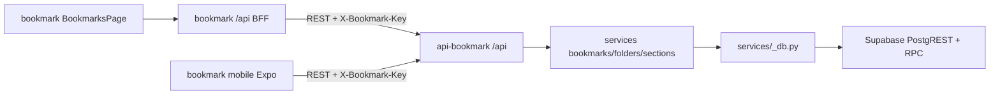
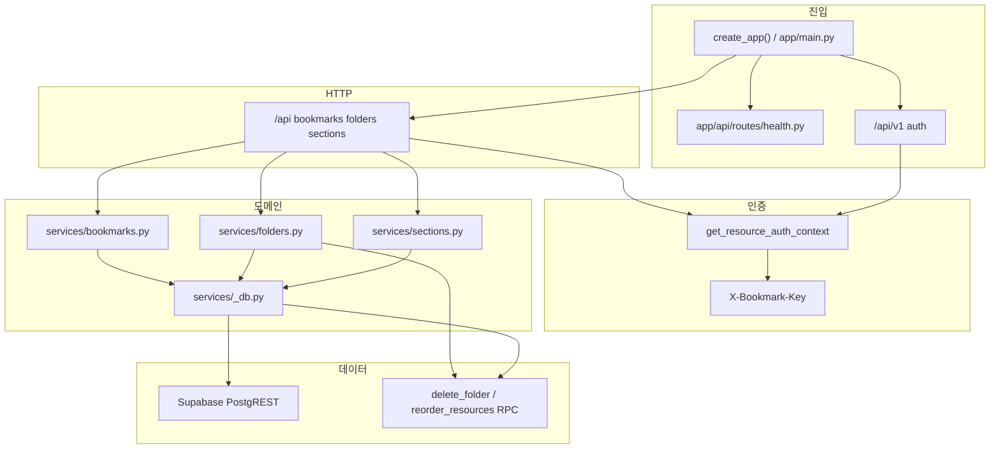

# Graphify 지식 그래프

이 저장소는 [Graphify](https://github.com/Graphify-Labs/graphify)로 코드 구조 그래프를 유지한다.
질의 가능한 산출물은 `graphify-out/`에 있다. AST 캐시(`graphify-out/cache/`)는 커밋하지 않는다.
공개 API는 REST만 있다. GraphQL(`/graphql`, strawberry)은 제거됐다.

추출 기준 커밋은 `graphify-out/GRAPH_REPORT.md`의 Graph Freshness를 본다.
코드 전용 추출(`--code-only`)이라 커뮤니티 이름은 `Community N`이다. 아래 표가 실제 모듈 매핑이다.

## 산출물

| 파일 | 용도 |
| --- | --- |
| `graphify-out/GRAPH_REPORT.md` | 커뮤니티·허브·고드 노드 요약 |
| `graphify-out/graph.json` | `query` / `path` / `explain` 원본 |
| `graphify-out/graph.html` | 인터랙티브 그래프 |
| `graphify-out/GRAPH_TREE.html` | 파일 트리 뷰 |
| `graphify-out/api-bookmark-callflow.html` | 호출 흐름 |

기존 스냅샷: **396 nodes · 1129 edges · 20 communities**. 현재 Supabase 전용 구현과 다릅니다.
2026-09-13 `graphify query/update`를 시도했으나 CLI가 없어 AST 갱신은 미완료입니다.
현재 런타임 경로는 아래 레이어 설명을 따릅니다.

## 워크스페이스

형제 저장소 `bookmark`와 런타임으로만 연결된다. 그래프를 합치려면:

```bash
graphify merge-graphs \
  graphify-out/graph.json \
  ../bookmark/graphify-out/graph.json \
  --out /tmp/workspace-merged-graph.json
```



웹 브라우저는 API 비밀을 보지 않는다. 모바일은 사용자가 입력한 키로 REST를 직접 호출한다.

## 레이어



## 커뮤니티 해석

| ID | 실제 의미 | 대표 심볼·파일 |
| --- | --- | --- |
| C2 | 도메인 서비스 + REST + 스키마 | `app/services/*`, `app/api/routes/{bookmarks,folders,sections,resources}.py`, `app/schemas.py` |
| C3 | (제거됨) 옛 GraphQL 스냅샷 | 현재 코드에 `app/graphql/` 없음 |
| C5 | 인증·Supabase 전송 | `get_resource_auth_context()`, `create_client()`, `service_user_id()` in `app/integrations/supabase.py` |
| C1 | 설정·헬스 | `Settings` / `app/core/config.py`, `app/api/routes/health.py` |
| C6 | 앱 조립·로깅·오류 봉투 | `app/main.py`, `app/core/logging.py`, `register_exception_handlers()`, `RequestContextMiddleware` |
| C0 | 리소스 HTTP 테스트 더블 + `create_app` 일부 | `tests/test_resources.py` |
| C4 | HTTP 오류 응답 | `_error_response()`, `JSONResponse` |
| C7 | Supabase 전송 테스트 | `tests/test_supabase.py` |
| C9 | 배포 메타 | `vercel.json` (`maxDuration`, `fluid`) |

위 커뮤니티 번호는 이전 스냅샷 기준이다. 현재 북마크/폴더/섹션 서비스는
`services/_db.py`의 CRUD 헬퍼와 `integrations/supabase.py`의 HTTP 전송을 경유한다.

## 그래프가 놓치는 런타임 엣지

FastAPI `Depends`는 파이썬 함수 호출이 아니라서 directed path가 비어 있을 수 있다.

| 질의 | 결과 | 해석 |
| --- | --- | --- |
| `path create_app list_bookmarks` | directed 없음 | import 조립이다. `--undirected`면 `create_app ← main → resources → bookmarks → list_bookmarks` (4 hops) |
| `path get_resource_auth_context request` | directed 없을 수 있음 | 라우트가 Depends로 인증하고 서비스가 HTTP 전송 함수를 호출한다 |
| `path AuthContext request --undirected` | 갱신 후 확인 | 서비스 컨텍스트가 Supabase HTTP 클라이언트를 전달한다 |
| `affected request` | 갱신 후 확인 | Supabase 전송이 서비스 CRUD와 REST 라우트에 영향을 준다 |

## 자주 쓰는 질의

```bash
graphify query "how do REST bookmark routes reach Supabase"
graphify explain "request"
graphify god-nodes
graphify path "create_app" "list_bookmarks" --undirected
graphify affected "request"
```

## 갱신

```bash
# AST만, API 키 불필요
graphify update .

# 리팩터로 노드가 줄면
graphify update . --force
```

시맨틱 커뮤니티 이름이 필요하면 API 키를 넣고 `graphify extract .` 또는 `graphify label .`를 실행한다.
SQL 마이그레이션을 그래프에 넣으려면 `uv tool install 'graphifyy[sql]'` 후 재추출한다.
